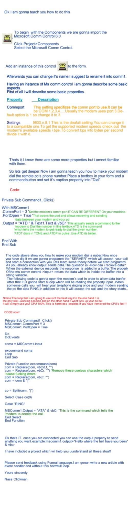



## Connection Via the Telephone line\.No internet or cable\.Just the telephone line

### Description

Hello Sirs,Madams, homosexuals,bisexuals or moving Spirits.

 

This article's purpose is to teach you how to connect with a remote system using your simple telephone line.No internet or special pc-cable required.If you have a telephone center with more than 4 lines you can make your pc a kind of "ISP".It's pretty simple.

To sum up it will let you connnect with your friend's pc and send and recieve data,files etc.

Important.

Read the article before suing the included program.Also i know .There are things to add.You can format a nice feedback saying abput what is missing and i will add it.

Also i am gonna post a new article how to send commands to your mobile phone (send sms read sms,turn of ,get charge status,signal quality more...) using this control.

I will return with more properties and commands!

have a nice reading.

My english suck.

Sincelrly him
 
### More Info
 

             |
---                |---
**Submitted On**   |2003-06-29 21:52:56
**By**             |[Steadler](https://github.com/Planet-Source-Code/PSCIndex/blob/master/ByAuthor/steadler.md)
**Level**          |Beginner
**User Rating**    |3.3 (33 globes from 10 users)
**Compatibility**  |VB 5\.0, VB 6\.0
**Category**       |[Coding Standards](https://github.com/Planet-Source-Code/PSCIndex/blob/master/ByCategory/coding-standards__1-43.md)
**World**          |[Visual Basic](https://github.com/Planet-Source-Code/PSCIndex/blob/master/ByWorld/visual-basic.md)
**Archive File**   |[Connection160868722003\.zip](https://github.com/Planet-Source-Code/steadler-connection-via-the-telephone-line-no-internet-or-cable-just-the-telephone-line__1-46596/archive/master.zip)

### Source Code

Red tha

